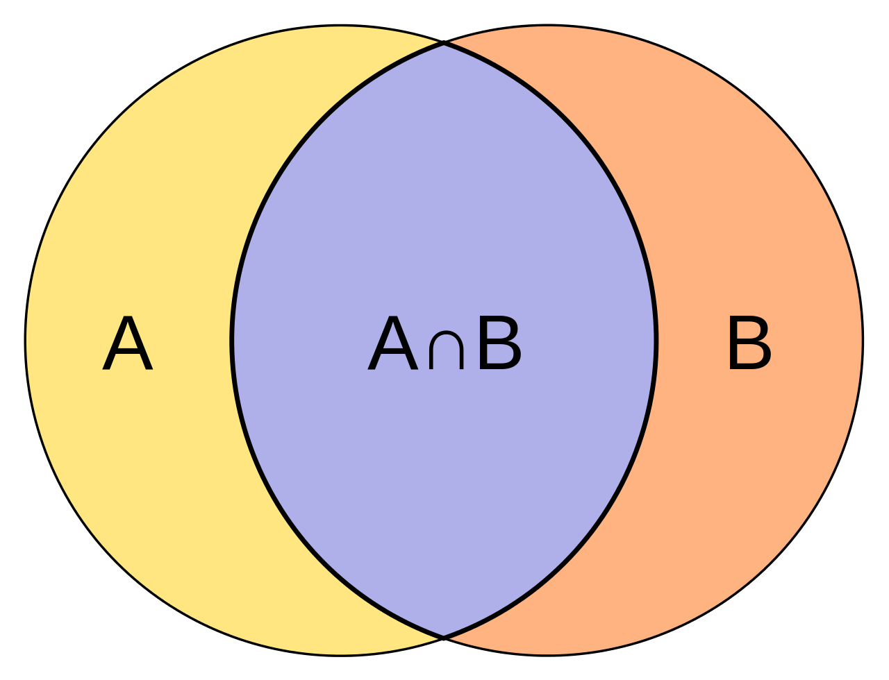
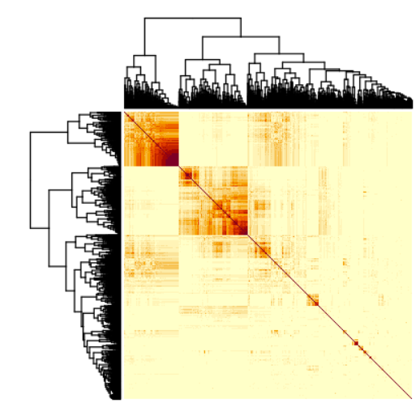

```{r setup, include=FALSE}
knitr::opts_chunk$set(echo = TRUE)
knitr::opts_chunk$set(
  echo = TRUE,         # Display code chunks
  eval = FALSE,         # Evaluate code chunks
  warning = FALSE,     # Hide warnings
  message = FALSE,     # Hide messages
  fig.width = 6,       # Set plot width in inches
  fig.height = 4,      # Set plot height in inches
  fig.align = "center" # Align plots to the center
)

```

Jaccard Similarity Score - the number of matching hits, divided by all possible hits between the two. The higher the score, the more similar the distribution of those genes across genomes.


# Heatmap of 3600 most abundant genes across reference bacterial species


## Using the Presence/Absence Matrix, generate Jaccard of a specific reference gene

Load in the presence/absence matrix
```{r Download_Data, eval=TRUE, cache=TRUE}
library(data.table)
library(tidyverse)

# read_csv or vroom are better alternatives
genes_merged <- read.csv("../../data/merged_genes_full.csv",row.names = 1, header= TRUE)
gene_list = genes_merged[,"gene_names"]
genes_merged <- column_to_rownames(genes_merged,var="gene_names")
```


## Single Gene Comparisons
Generate Jaccard Similarity Score for each gene against a specific reference gene
```{r Jaccard, eval=TRUE, cache=TRUE}
# Pick the reference gene you're going to track
ref_gene <- as.numeric(genes_merged["nifH",])

# gene_count =as.data.frame(rowSums(genes_merged))
# gene_count <- tibble::rownames_to_column(gene_count, "gene_name")


# Calculate Jaccard Similarity
gene_matches <- colSums(t(genes_merged)+ref_gene==2)
gene_totalhits <- colSums(t(genes_merged)+ref_gene>0)
fave_genes <- sort(gene_matches/gene_totalhits, decreasing = TRUE)
```

Generates a confusion matrix of the top 10 best hits - useful to verify the matrix
```{r matrix}
# Check the confusion matrix of the top 10 best matched genes
confusion_top10 <- lapply(names(head(fave_genes, 10)), function(gene_name){
  table(as.numeric(genes_merged["acnA",]), 
        as.numeric(genes_merged[gene_name,]))
})
```

Plot the distribution
``` {r narG plot, eval=TRUE}
library(tidyverse)
# plot the ordered data based on similarity score
x_steps = seq(1, length(fave_genes)-1, 1)
y_steps = fave_genes[-1]
df = data.frame(x=x_steps,y=y_steps)
ggplot(data=df,mapping = aes(x, y))+geom_point()
```
### Notes from specific genes

nifH is kinda interesting - lots of metal binding genes associated amidst the other nif genes


## Generate a Jaccard similarity matrix of all genes with greater than 100 counts
```{r Jaccard_Full, eval=FALSE}
# Generate the Counts of the Genes
gene_count =as.data.frame(rowSums(genes_merged))
gene_count <- tibble::rownames_to_column(gene_count, "gene_name")

# Exclude any gene with fewer than min_num_genes hits
min_num_genes <- 100
gene_count$min <- ifelse(gene_count$`rowSums(genes_merged)` > min_num_genes, 1, 0)
genes_merged <- tibble::rownames_to_column(genes_merged, "gene_name")

# Filter on main
genes_merged = genes_merged[as.logical(gene_count$min),]
gene_list = genes_merged[,"gene_name"]

genes_merged <- tibble::remove_rownames(genes_merged)
genes_merged <- tibble::column_to_rownames(genes_merged, "gene_name")


# Calculate Jaccard Similarity Matrix
holder <- lapply(gene_list, function(gene_i) {

  ref_gene <- as.numeric(genes_merged[gene_i,])
  gene_matches <- colSums(t(genes_merged)+ref_gene==2)
  gene_totalhits <- colSums(t(genes_merged)+ref_gene>0)
  gene_matches/gene_totalhits
  })

jaccard_matrix <- do.call(rbind, holder)
row.names(jaccard_matrix) <- gene_list

write.csv(jaccard_matrix, "../../data/jaccard_matrix.csv", row.names=TRUE)
```
Find the highest values 
```{r, eval=FALSE, cache= TRUE}
heatmap(jaccard_matrix, sym=TRUE)
```
Distance Clustering - just hierachical. There are three general clusters that immediately jump out to me. Guess is that the first cluster is all of the core required genes that almost all microbes have. But what about everything else?

Verify the dendrogram - cophenetic correlation ends up being around 0.78, not amazing but reasonable to work with.
```{r}
hc = hclust(dist(jaccard_matrix))
plot(hc)
# Is it possible to put data into dendrogram - close to 1 is good, close to 0 is bad
cophen = cophenetic(hc)
verify = cor(dist(jaccard_matrix), cophen)
```

``` {r}
# Order the Abundance for correct mapping to the plot
hc_labels = as.data.frame(hc$labels)
hc_labels$index = 1:length(hc$labels)

gene_abund_index = merge(hc_labels,gene_count,by.x="hc$labels",by.y="gene_name")

gene_abund_index$order <- hc$order
gene_ordered = arrange(gene_abund_index, index)[hc$order,]
```

``` {r plot cluster}
colorfun = colorRamp(c("red","blue"))

cl_members <- cutree(tree = hc, k = 3)
plot(x = hc, labels =  row.names(hc), cex = 0.5, hang= -1)
points(x=1:3686,y=numeric(3686),col=rgb(colorfun(gene_count$abundance[hc$order]), maxColorValue = 255))
# rect.hclust(tree = hc, k = 3, which = 1:3, border = 1:3, cluster = cl_members)

pdf("~/sam-associationstudy/output/gene_clusters.pdf",width = 250)
plot(x = hc, labels =  row.names(hc), cex = 0.5, hang= -1)
points(x=1:3686,y=numeric(3686),col=rgb(colorfun(gene_ordered$abundance), maxColorValue = 255))
dev.off()
```
See saved PDF:Blue indicate highly abundant genes while Red are not very abundant genes. The first cluster are all highly expressed, cluster 3 are not highly expressed. The second cluster though has an interesting mix. Need to dive into it more

```{r}
# 
# 1diag(jaccard_matrix) <- 0
corr_genes <- which(jaccard_matrix==max(jaccard_matrix), arr.ind=TRUE)
# Verify
sum(genes_merged["anfD",])
sum(genes_merged["anfG",])
num_occ = sort(rowSums(genes_merged),decreasing=TRUE)

# Find the most abundant gene
which.max(rowSums(genes_merged))
```

``` {r}
gene_count$abundance = gene_count$`rowSums(genes_merged)`/17019
```


``` {r frr_example, eval=TRUE, cache=TRUE}
library(tidyverse)
jaccard_matrix = read.csv("../../data/jaccard_matrix.csv", row.names=1, header=TRUE)
ggplot()+geom_histogram(aes(jaccard_matrix[,"frr"]),bins = 200)

```

```{r additional_nifH, eval=TRUE}
ggplot()+geom_histogram(aes(jaccard_matrix[,"nifH"]),bins = 200)
```

```{r additional_tssK, eval=TRUE}
ggplot()+geom_histogram(aes(jaccard_matrix[,"cirA"]),bins = 200)
```
Which genes have the most correlation
```{r}
genes_total_corr = as.data.frame(rowSums(jaccard_matrix))
cluster1_df = as.data.frame(cluster1)
# Need to fix
test = filter(genes_total_corr, rownames(genes_total_corr) == cluster1)
```

# Quick Script to take a gene and find the most correlated values
```{r}
ref_gene = "betA"
fav_genes = sort(jaccard_matrix[ref_gene,],decreasing=TRUE)
```


## Co-occurence Graph
```{r cooccurence}
library(igraph)
graph_jaccard_matrix = jaccard_matrix
graph_jaccard_matrix[jaccard_matrix < 0.6] <- 0
graph_jaccard_matrix <- as.matrix(graph_jaccard_matrix)
graph_jaccard <- graph.adjacency(graph_jaccard_matrix, mode="undirected", weighted = T,diag=FALSE)
coords <- layout_in_circle(graph_jaccard)
plot(graph_jaccard, layout=coords)

```


Code based on https://plotly.com/r/network-graphs/

```{r plot_graph_plotly_attempt}
vs <- V(graph_jaccard)
es <- as.data.frame(get.edgelist(graph_jaccard))

Nv <- length(vs)
Ne <- length(es[1]$V1)
Xn <- coords[,1]
Yn <- coords[,2]

network <- plot_ly(x = ~Xn, y = ~Yn, mode = "markers", text = vs$label, hoverinfo = "text")

edge_shapes <- list()
for(i in 1:Ne) {
  v0 <- es[i,]$V1
  v1 <- es[i,]$V2

  edge_shape = list(
    type = "line",
    line = list(color = "#030303", width = 0.3),
    x0 = Xn[v0],
    y0 = Yn[v0],
    x1 = Xn[v1],
    y1 = Yn[v1]
  )

  edge_shapes[[i]] <- edge_shape
}
 
axis <- list(title = "", showgrid = FALSE, showticklabels = FALSE, zeroline = FALSE)

fig <- layout(
  network,
  title = 'Gene Co-occurence Network',
  shapes = edge_shapes,
  xaxis = axis,
  yaxis = axis
)

```

```{r savefig}
library(htmlwidgets)

htmlwidgets::saveWidget(
                widget = fig, #the plotly object
                file = "figure.html", #the path & file name
                selfcontained = TRUE #creates a single html file
                )

```
